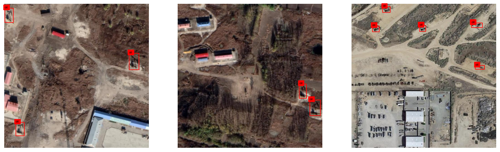

# Приложение для обнаружения нефтяных скважин
**[➡➡➡кликай сюда⬅⬅⬅](https://well-detector-yolov8-ko3oxyhhgpthwubuhvjdmt.streamlit.app/)**

В современном мире, где нефть и газ играют ключевую роль в устойчивом, стабильном и процветающем развитии национальной экономики, и являются важным элементом жизнеобеспечения населения, как отмечается в Статистическом ежегоднике мировой энергетики BP за 2022 год, особое внимание уделяется эффективному использованию ресурсов и управлению нефтегазовыми запасами. В ответ на проблемы энергосбережения, сокращения выбросов и углеродного сокращения, повышение эффективности использования ресурсов и проведение комплексного распределения нефтегазовых ресурсов для эффективного реагирования на чрезвычайные ситуации становятся критически важными.

[Мировое потребление энергии,BP 2022](https://www.bp.com/content/dam/bp/business-sites/en/global/corporate/pdfs/energy-economics/statistical-review/bp-stats-review-2022-full-report.pdf):

Нефтяные скважины, являющиеся основным объектом для добычи нефти, представляют собой важный индикатор состояния нефтегазовых ресурсов. Распределение и количество нефтяных скважин дают ценное представление о статусе нефтегазовых запасов. Использование спутниковых снимков для удаленного мониторинга позволяет отслеживать динамику глобальной эксплуатации нефтяной энергии и оценивать производство нефти в различных регионах.

В свете этого, разработка специализированного программного обеспечения для анализа спутниковых снимков становится ключевой задачей. Такое ПО должно автоматически обрабатывать изображения, выявляя расположение и состояние нефтяных скважин. Это обеспечит более быстрый и точный анализ, уменьшая риск человеческой ошибки и повышая общую эффективность мониторинга.

Такой подход не только улучшит управление нефтегазовыми ресурсами, но и поможет предотвратить потенциальные экологические катастрофы, способствуя устойчивому развитию и энергетической безопасности. Программное обеспечение для анализа спутниковых снимков станет важным инструментом в руках бизнеса и правительств для планирования и прогнозирования энергетических расчетов, добычи и предупреждения аварийных ситуаций.

# Описание приложения

На стороне backend будет происходить основная обработка данных: анализ загруженных спутниковых изображений c помощью модели YOLO-v8.

Frontend часть приложения предназначена для интерактивной работы пользователя с системой. 
Она включает в себя возможности для загрузки изображений и просмотра результатов работы модели, включая информацию о наличии и расположении нефтяных скважин.

## Функции первой версии приложения:

- Загрузка Изображений: Пользователи могут загружать одно или несколько изображений на сервер для дальнейшей обработки.
- Отображение Результатов: После обработки изображений backend отправляет данные на frontend, где пользователи могут видеть результаты, включая информацию о наличии скважин.

*Идеальный прототип*
Приложения представляет собой веб-сервис, который регулярно, с определенной периодичностью и на основе заданных эвристик, выполняет поиск по спутниковым снимкам за разное время. Он отображает на карте координаты скважин и примерную дату их появления. Идеально, если детектор будет многофункциональным, способным не только идентифицировать скважины, но и сегментировать сопутствующую инфраструктуру, включая площадки для бурения и нефтепроводы. Такой подход значительно уменьшит вероятность ошибок и повысит достоверность данных о наличии скважин.

# Использование
`Run streamlit run Home.py`  если вы хотите запустить у себя, если посмотреть [онлайн-демо](https://well-detector-yolov8-ko3oxyhhgpthwubuhvjdmt.streamlit.app/)  
Приложение откроется в окне браузера
